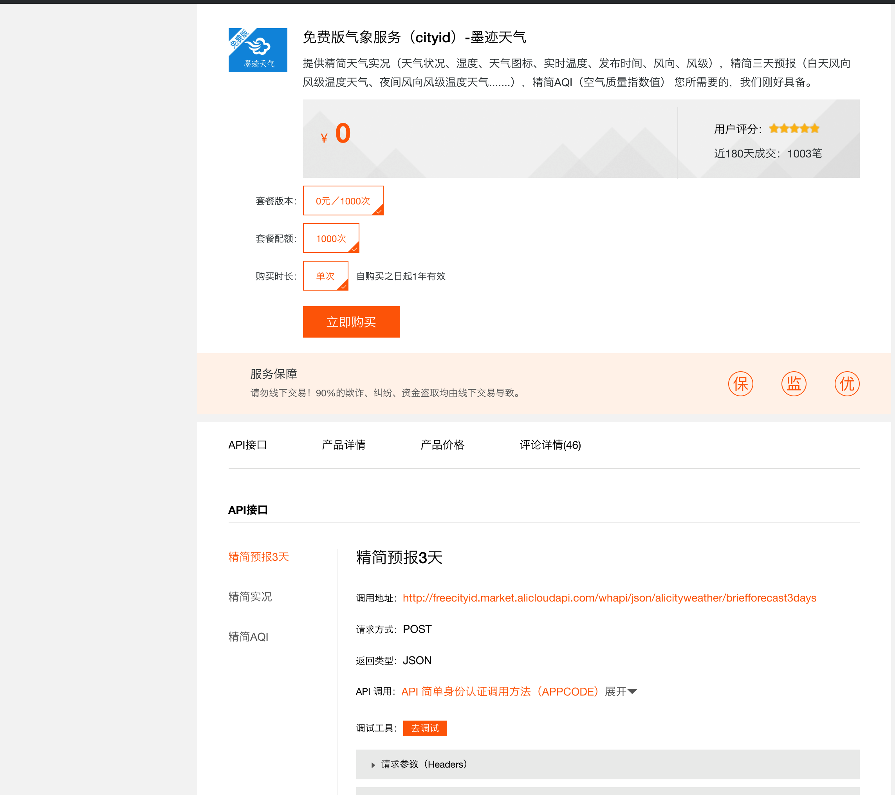
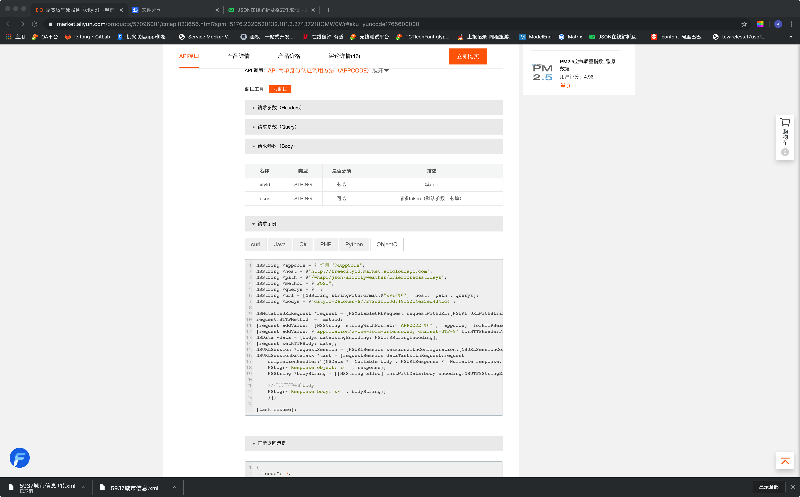
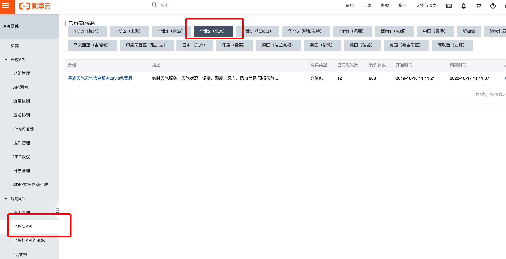
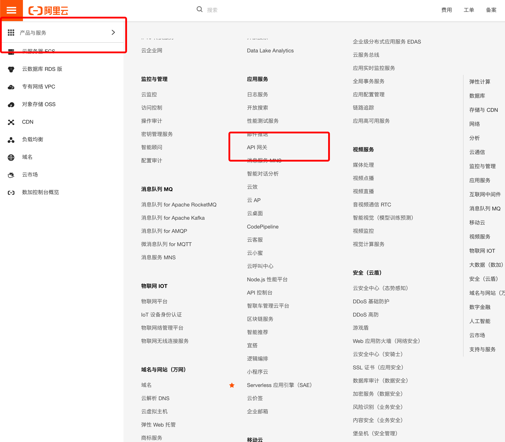

# Swfit_Networking_Request-data_Parse[1]

#### 使用系统方法请求天气接口
```
<!--接口-->

 func getWeatherResponse() -> Void {
 <!--URL去阿里云墨迹天气注册，会提供code，token-->
        let url: String = "http://freecityid.market.alicloudapi.com/whapi/json/alicityweather/briefforecast3days"
        let code  = "f3026e20bd8a474e9453a63873cb9e34"
        let bodys: String = "cityId=2&token=677282c2f1b3d718152c4e25ed434bc4"
        <!--设置头部-->
        let header:HTTPHeaders = ["Authorization" : "APPCODE \(code) ",
            "Content-Type" : "application/x-www-form-urlencoded; charset=UTF-8"
        ]
        <!--设置request-->
        let request = NSMutableURLRequest.init(url: NSURL.init(string: url)! as URL)
        request.httpMethod = "POST"
        request.addValue("APPCODE \(code)", forHTTPHeaderField: "Authorization")
        request.addValue("application/x-www-form-urlencoded; charset=UTF-8", forHTTPHeaderField:  "Content-Type")
        
        let data = bodys.data(using: String.Encoding.utf8)
        request.httpBody = data
        
        let session = URLSession.init(configuration: URLSessionConfiguration.default)
        let tast = session.dataTask(with: request as URLRequest) { (datas, responses, error) in
            let dict: NSDictionary = try! JSONSerialization.jsonObject(with: datas ?? Data.init(), options: JSONSerialization.ReadingOptions.mutableLeaves) as! NSDictionary
            print(dict)
            <!--json数据解析-->
            let pDataDict: NSDictionary = dict.object(forKey: "data") as! NSDictionary
            let pForecastArray: NSArray = pDataDict.object(forKey: "forecast") as! NSArray
            let pCityDict: NSDictionary = pDataDict.object(forKey: "city") as! NSDictionary
            let pCity: City = City.init()
            
            pCity.cityId = pCityDict.object(forKey: "cityId") as! Int
            pCity.pname = pCityDict.object(forKey: "pname") as! String
            pCity.counname = pCityDict.object(forKey: "counname") as! String
            pCity.name = pCityDict.object(forKey: "name") as! String
            pCity.secondaryname = pCityDict.object(forKey: "secondaryname") as! String
            
            var forecastArray: [ForeCast] = NSMutableArray.init() as! [ForeCast]
            
            for m in pForecastArray {
                let pForecastDict = m as!NSDictionary
                let pForecast: ForeCast = ForeCast.init()
                pForecast.conditionDay = pForecastDict.object(forKey: "conditionDay") as! String
                pForecast.conditionIdDay = pForecastDict.object(forKey: "conditionIdDay") as! String
                pForecast.conditionIdNight = pForecastDict.object(forKey: "conditionIdNight") as! String
                pForecast.conditionNight = pForecastDict.object(forKey: "conditionNight") as! String
                pForecast.predictDate = pForecastDict.object(forKey: "predictDate") as! String
                pForecast.tempDay = pForecastDict.object(forKey: "tempDay") as! String
                pForecast.tempNight = pForecastDict.object(forKey: "tempNight") as! String
                pForecast.updatetime = pForecastDict.object(forKey: "updatetime") as! String
                pForecast.windDirDay = pForecastDict.object(forKey: "windDirDay") as! String
                pForecast.windDirNight = pForecastDict.object(forKey: "windDirNight") as! String
                pForecast.windLevelDay = pForecastDict.object(forKey: "windLevelDay") as! String
                pForecast.windLevelNight = pForecastDict.object(forKey: "windLevelNight") as! String
                forecastArray.append(pForecast)
            }
            let pData = Datas.init(city: pCity, forecast: forecastArray)
            let pForecastModel = ForecastModel.init(data: pData)
            print(pForecastModel)
        }
        tast.resume()
        
    }
    
<!--数据model-->

class ForecastModel: NSObject {
    var data = Datas(city: City.init(), forecast: [ForeCast.init()])
    init(data: Datas) {
        self.data = data
    }
}

class Datas: NSObject {
    var city = City()
    var forecast:[ForeCast] = []
    init(city: City, forecast:[ForeCast]) {
        self.city = city
        self.forecast = forecast
    }
}

class City: NSObject {
    var cityId: Int = 0
    var counname: String = ""
    var name: String = ""
    var pname: String = ""
    var secondaryname: String = ""
}
class ForeCast: NSObject {
    var conditionDay: String = ""
    var conditionIdDay: String = ""
    var conditionIdNight: String = ""
    var conditionNight: String = ""
    var predictDate: String = ""
    var tempDay: String = ""
    var tempNight: String = ""
    var updatetime: String = ""
    var windDirDay: String = ""
    var windDirNight: String = ""
    var windLevelDay: String = ""
    var windLevelNight: String = ""
}

```

#### 使用第三方AlamofireObjectMapper

```
<!--接口-->

func getWeatherResponse() -> Void {
        let url: String = "http://freecityid.market.alicloudapi.com/whapi/json/alicityweather/briefforecast3days"
        let dic = ["cityId" : "1098",
                   "token" : "677282c2f1b3d718152c4e25ed434bc4"
        ]
        let code  = "f3026e20bd8a474e9453a63873cb9e34"
        let header:HTTPHeaders = ["Authorization" : "APPCODE \(code) ",
            "Content-Type" : "application/x-www-form-urlencoded; charset=UTF-8"
        ]
        Alamofire.request(url, method: HTTPMethod.post, parameters: dic, encoding: URLEncoding.default, headers: header).responseObject {(response: DataResponse<RESModel>) in
            self.resModel = response.result.value
            print(self.resModel!)
            
        }
    }
    
<!--数据model-->
import ObjectMapper

class RESModel: Mappable {
    var data: pData?
    required init?(map: Map) {
        
    }
    
    func mapping(map: Map) {
        data <- map["data"]
    }
    
    
}

class pData: Mappable {
    var forecast: [pForecast]?
    var city: pCity?
    
    
    required init?(map: Map) {
        
    }
    
    func mapping(map: Map) {
        forecast <- map["forecast"]
        city <- map["city"]
    }
    
    
}


class pForecast: Mappable {
    
    var conditionDay: String?
    var conditionIdDay: String?
    var conditionIdNight: String?
    var conditionNight: String?
    var humidity: String?
    var predictDate: String?
    var tempDay: String?
    var tempNight: String?
    var updatetime: String?
    var windDegreesDay: String?
    var windDegreesNight: String?
    var windDirDay: String?
    var windDirNight: String?
    var windLevelDay: String?
    var windLevelNight: String?
    
    
    required init?(map: Map) {
        
    }
    
    func mapping(map: Map) {
        conditionDay <- map["conditionDay"]
        conditionIdDay <- map["conditionIdDay"]
        conditionIdNight <- map["conditionIdNight"]
        conditionNight <- map["conditionNight"]
        humidity <- map["humidity"]
        predictDate <- map["predictDate"]
        tempDay <- map["tempDay"]
        tempNight <- map["tempNight"]
        updatetime <- map["updatetime"]
        windDegreesDay <- map["windDegreesDay"]
        windDegreesNight <- map["windDegreesNight"]
        windDirDay <- map["windDirDay"]
        windDirNight <- map["windDirNight"]
        windLevelDay <- map["windLevelDay"]
        windLevelNight <- map["windLevelNight"]
    }
    
    
}
class pCity: Mappable {
    
    var cityId: Int?
    var ianatimezone: String?
    var name: String?
    var pname: String?
    var counname: String?
    var secondaryname: String?
    var timezone: String?
    required init?(map: Map) {
        
    }
    
    func mapping(map: Map) {
        cityId <- map["cityId"]
        ianatimezone <- map["ianatimezone"]
        name <- map["name"]
        pname <- map["pname"]
        counname <- map["counname"]
        secondaryname <- map["secondaryname"]
        timezone <- map["timezone"]
    }  
}

```

#### 如何获取墨迹天气接口

1. 注册接口地址

 
2. 查看接口参数


3. 查看接口地址


